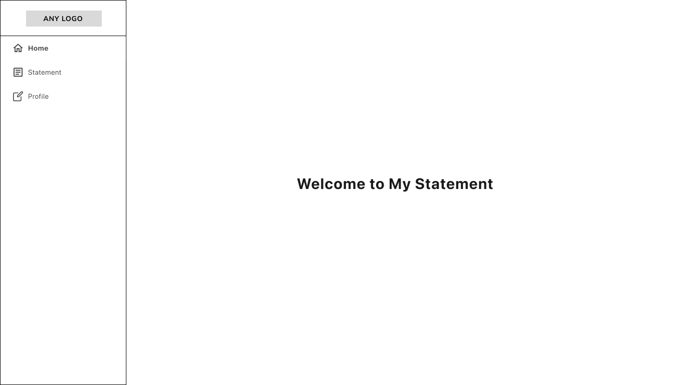

# Front-end Developer Technical Challenge 4 - Dashboard

## Objective:

Creation of a dashboard with a side menu with the following items:

- Home
- Statements
- Profile

Like This (home):

## Specifications:

### 1. Home

- The home page should contain a welcome message 

### 2. Statements

Now this page is a blank page in next challenge you will create a list of statements.

### 3. Profile

Now this page is a blank page in next challenge you will create a profile page for edit user information.

### Bonus:

- Unit Testing: As an added advantage, we'd be highly impressed if you can integrate unit tests for the designed interface. It will provide us with a clear understanding of your proficiency in ensuring the robustness and reliability of your implementations.

## Final Considerations:

- Your user interface should not only be functional but also intuitive and user-friendly.