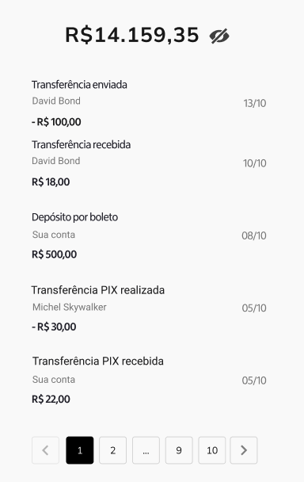

# Front-end Developer Technical Challenge 5 - Statement List and Amount

Its main mission is to design and implement a screen that displays the user's balance and their list of bank transactions with pagination, hiding the display of values.

You are expected to create this interface in your preferred language/framework.

# Example:



### Pagination:

The route should receive two parameters, `limit` and `offset`, the `limit` parameter will be the number of statements to be returned and the `offset` parameter will be the number of statements to be skipped. 

**GET:** `/statements/{limit}/{offset}`

### Response:

- After successfully processing the input data and CHECK the auth information, the endpoint should return a status code of 200 OK. With JSON Statement list:

```json
[
  {
    "type": "Deposit",
    "amount": "15000.00",
    "description": "Payment from Freela",
    "from_user": "John Doe",
    "authentication": "45d064afbd6cf24613daed52133320b84ece0e2cc751995a4d0b94fca84823dd",
    "id": 1,
    "created_at": "2023-09-21T18:46:45.478966",
    "to_user": "John Doe",
    "bank_name": "Adams LLC"
  },
  {
    "type": "Deposit",
    "amount": "88.81",
    "description": "Trip authority window myself hour.",
    "from_user": "Holly Bailey",
    "authentication": "0ef6dc8284c7908ce7af354b10b6f354ff355a201f8f54e22bd60d928a6670c8",
    "id": 2,
    "created_at": "2020-09-07T00:00:00",
    "to_user": "Caitlin Bennett",
    "bank_name": "Williams-Norris"
  }, ....
]
```

## Validations:

- The Route is authenticated, so it is necessary to send the token, otherwise the user will receive a 401 unauthorized status code, with the following message:

```json
{
  "detail": "Not authenticated"
}
```

### Bonus:

- Unit Testing: As an added advantage, we'd be highly impressed if you can integrate unit tests for the designed interface. It will provide us with a clear understanding of your proficiency in ensuring the robustness and reliability of your implementations.

## Final Considerations:

- Your user interface should not only be functional but also intuitive and user-friendly.
- The design should take into account both aesthetics and usability.
- Be sure to write a good README guiding how to run your project, dependencies and what you think is necessary to install and run the project.

Challenges like this offer a unique opportunity to showcase your skills. We wish you the best and eagerly await your innovative solution!


### Bonus:

- Unit Testing: As an added advantage, we'd be highly impressed if you can integrate unit tests for the designed interface. It will provide us with a clear understanding of your proficiency in ensuring the robustness and reliability of your implementations.

## Final Considerations:

- Your user interface should not only be functional but also intuitive and user-friendly.
- The design should take into account both aesthetics and usability.
- Be sure to write a good README guiding how to run your project, dependencies and what you think is necessary to install and run the project.

Challenges like this offer a unique opportunity to showcase your skills. We wish you the best and eagerly await your innovative solution!
