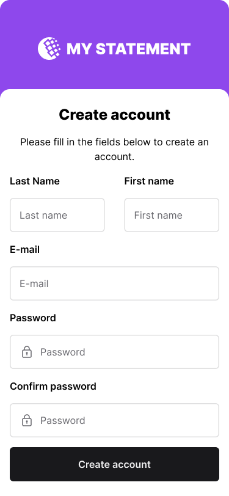

## Objective:

Your primary mission is to design and implement a user-friendly interface that interacts with the `users` route for user registration. You are expected to craft this interface in your preferred language/framework.

## Specifications:

### Figma

Access the [Figma link](https://www.figma.com/file/Q44nlEVrODE7W6iBFRVPZL/Desafio-para-devs---App-%2F-Dashboard-%7C-UX%2FUI?type=design&node-id=1%3A655&mode=design&t=aSjbTNYsb0UGO0yp-1) to follow the style guide and components in your interfaces.



### 1. User Registration Form:

- Your interface should provide a registration form containing the following fields:
  - User ID (to be filled with an email): userid
  - Password: password
  - Full Name: fullname
  - Birthdate: birthdate
  
The form structure should closely align with this JSON model:

```json
{
    "userid": "user@example.com",
    "password": "string",
    "fullname": "string",
    "birthdate": "2023-09-22"
}
```

### 2. API Communication:

- To gain a better understanding of the request details and expected API responses, you are encouraged to refer to the comprehensive API documentation available at: [http://localhost:8000/docs#/users/create_user_users__post](http://localhost:8000/docs#/users/create_user_users__post).

[Online API Doc](https://dev-challenge.micheltlutz.me/docs)


### Bonus:

- Unit Testing: As an added advantage, we'd be highly impressed if you can integrate unit tests for the designed interface. It will provide us with a clear understanding of your proficiency in ensuring the robustness and reliability of your implementations.

## Final Considerations:

- Your user interface should not only be functional but also intuitive and user-friendly.
- The design should take into account both aesthetics and usability.
- Be sure to write a good README guiding how to run your project, dependencies and what you think is necessary to install and run the project.

Challenges like this offer a unique opportunity to showcase your skills. We wish you the best and eagerly await your innovative solution!
