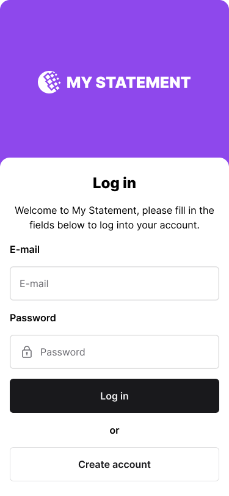

# Mobile Developer Technical Challenge 2


## Objective:

Your primary mission is to design and implement a user-friendly interface form to user login interface that interacts with the `auth` route for user login. You are expected to craft this interface in your preferred language/framework.

## Specifications:

### Figma

Access the [Figma link](https://www.figma.com/file/Q44nlEVrODE7W6iBFRVPZL/Desafio-para-devs---App-%2F-Dashboard-%7C-UX%2FUI?type=design&node-id=1-731&mode=design&t=1oLA9vtlXknWRtig-4) to follow the style guide and components in your interfaces.



### 1. User Login Form:

- Your interface should provide a login form containing the following fields:
  - User ID (to be filled with an email): userid
  - Password: password

The form structure should closely align with this JSON model:

```json
{
    "userid": "john.doe@email.com",
    "password": "string"
}
```

### 2. API Communication:

- To gain a better understanding of the request details and expected API responses, you are encouraged to refer to the comprehensive API documentation available at: [http://localhost/docs#/auth/login_auth__post](http://localhost/docs#/auth/login_auth__post).
- The API will return a JSON object containing the access token and token type. You should store the access token in the browser's local storage for future requests.
- The access token should be sent in the `Authorization` header of all future requests to the API.
- The access token should be prefixed with the token type and a space, like this: `Bearer <access_token>`

**Response example**:

```json
{
    "access_token": "access_token", 
    "token_type": "bearer"
}
```

### Bonus:

- Unit Testing: As an added advantage, we'd be highly impressed if you can integrate unit tests for the designed interface. It will provide us with a clear understanding of your proficiency in ensuring the robustness and reliability of your implementations.

## Final Considerations:

- Your user interface should not only be functional but also intuitive and user-friendly.
- The design should take into account both aesthetics and usability.
- Be sure to write a good README guiding how to run your project, dependencies and what you think is necessary to install and run the project.

Challenges like this offer a unique opportunity to showcase your skills. We wish you the best and eagerly await your innovative solution!
