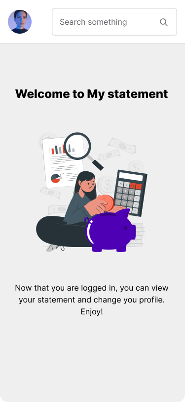
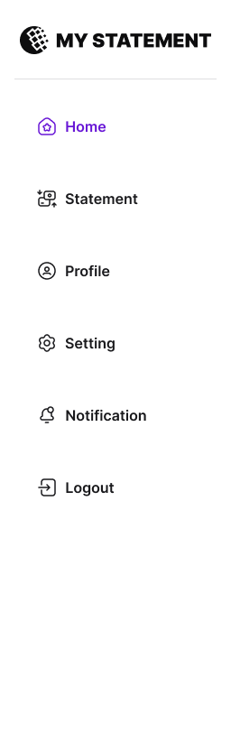

# Mobile Developer Technical Challenge 3 - Dashboard and Side Menu

## Objective:

Creation of a dashboard with a side menu with the following items:

- Home
- Statements
- Profile

*Optionals (Api under development for the items below)*

- Setting
- Notification
- Logout

## Specifications:

### Figma

Access the [Figma link](https://www.figma.com/file/Q44nlEVrODE7W6iBFRVPZL/Desafio-para-devs---App-%2F-Dashboard-%7C-UX%2FUI?type=design&node-id=13-4267&mode=design&t=1oLA9vtlXknWRtig-4) to follow the style guide and components in your interfaces.

| Home                  | Side Menu               |
|-----------------------|-------------------------|
|  |  |

### 1. Home

- The home page should contain a welcome message 

### 2. Statements

Now this page is a blank page in next challenge you will create a list of statements.

### 3. Profile

Now this page is a blank page in next challenge you will create a profile page for edit user information.

### Bonus:

- Unit Testing: As an added advantage, we'd be highly impressed if you can integrate unit tests for the designed interface. It will provide us with a clear understanding of your proficiency in ensuring the robustness and reliability of your implementations.

## Final Considerations:

- Your user interface should not only be functional but also intuitive and user-friendly.