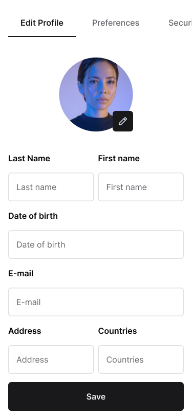

# Mobile Developer Technical Challenge 5 - Edit Profile information

Its main mission is to design and implement a screen that displays user registration data and allows editing and saving this data.

You are expected to create this interface in your preferred language/framework.

### Figma

Access the [Figma link](https://www.figma.com/file/Q44nlEVrODE7W6iBFRVPZL/Desafio-para-devs---App-%2F-Dashboard-%7C-UX%2FUI?type=design&node-id=19-4040&mode=design&t=1oLA9vtlXknWRtig-4) to follow the style guide and components in your interfaces.



## Specifications:

**PUT**: `/users/{user_id}`

### Edit User Profile:

- The route should expect a PUT request with a JSON body formatted as:

```json
{
  "password": "string",
  "fullname": "string",
  "birthdate": "2024-01-02"
}
```

> At this moment, the api does not yet support other image fields and image uploading. We will soon be evolving it. Feel free to contribute.


## Validations:

- The Route is authenticated, so it is necessary to send the token, otherwise the user will receive a 401 unauthorized status code, with the following message:

```json
{
  "detail": "Not authenticated"
}
```

### Bonus:

- Unit Testing: As an added advantage, we'd be highly impressed if you can integrate unit tests for the designed interface. It will provide us with a clear understanding of your proficiency in ensuring the robustness and reliability of your implementations.

## Final Considerations:

- Your user interface should not only be functional but also intuitive and user-friendly.
- The design should take into account both aesthetics and usability.
- Be sure to write a good README guiding how to run your project, dependencies and what you think is necessary to install and run the project.

Challenges like this offer a unique opportunity to showcase your skills. We wish you the best and eagerly await your innovative solution!
