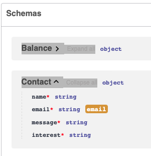

## Instructions for challenged

This project is already prepared with a instructions for you to create a docker image and run it so that you have your api environment without the need to configure the entire project.

Follow the instructions below to carry out the procedure.

## News 

Now, the challenges are available in the cloud as I have deployed the API to streamline the initial access. Check out the documentation at: [https://dev-challenge.micheltlutz.me/docs](https://dev-challenge.micheltlutz.me/docs). However, you still have the option to use the challenges locally, either by using Docker or by setting up the Python environment.


## Requirements to run local

- Terminal

**For Linux**
- [Docker Engine](https://docs.docker.com/engine/install/ubuntu/)

**For macOS**
- [Rancher Desktop](https://docs.rancherdesktop.io/getting-started/installation#macos)

**Windows**
- [WSL2](https://learn.microsoft.com/en-us/windows/wsl/install)
- [Rancher Desktop](https://docs.rancherdesktop.io/getting-started/installation#windows)

> **Attention!:** If you are using Windows, you need to run the terminal as administrator.
>
> Prefer Rancher Desktop, it is free, more complete and has more features

## 1. Create Image

```bash
docker build -t "dev-challenge" .
```

### 2. Check if image was created

```bash
docker images
```
## 3. Run container

```bash
docker run -d --name dev-challenge-demo -p 8000:8000 dev-challenge:latest
```

## 4. Check if container is running

```bash
docker ps
```

## 5. Access the API

- [http://localhost:8000](http://localhost:8000)

## Stop container

When you need to stop the container, run the code below in your terminal

```bash
docker stop dev-challenge-demo
```

## Api Documentation information

The project documentation uses swagger, you can access it after running the docker container and accessing the address below in the browser, where you will find the routes, parameters and schemes of each of the routes created for your challenge, in addition to being able to execute the routes directly in the documentation.

- [http://localhost:8000/docs](http://localhost:8000/docs)
- [Online Docs](https://dev-challenge.micheltlutz.me/docs)

Routes with authentication have a padlock icon




## Challanges


### Figma

Access the [Figma link](https://www.figma.com/file/Q44nlEVrODE7W6iBFRVPZL/Desafio-para-devs---App-%2F-Dashboard-%7C-UX%2FUI?type=design&node-id=1%3A655&mode=design&t=aSjbTNYsb0UGO0yp-1) to follow the style guide and components in your interfaces.


### Front-End

For front-end developers, we provide a ready-to-use API set up to run in a Docker environment. This API includes routes for listings, authentication, user creation, login, among other features. This allows the developer to focus primarily on the design and implementation of interfaces.

- [Challenge 1. Contact Form No Figma](challenge_frontend1.md)
- [Challenge 2. Create User Form](challenge_frontend2.md)
- [Challenge 3. Login Form](challenge_frontend3.md)
- [Challenge 4. Dashboard](challenge_frontend4.md)
- [Challenge 5. Show Amount and Pagination Statent](challenge_frontend5.md)
- [Challenge 6. Profile Edit](challenge_frontend6.md)


### Mobile - WIP

For front-end developers, we provide a ready-to-use API set up to run in a Docker environment. This API includes routes for listings, authentication, user creation, login, among other features. This allows the developer to focus primarily on the design and implementation of interfaces.

- [Challenge 1. Create User Form WIP]()
- [Challenge 2. Login Form WIP]()
- [Challenge 3. Dashboard WIP]()
- [Challenge 4. Show Amount and Pagination Statent WIP]()
- [Challenge 5. Profile Edit WIP]()

 
### Back-End

The challenge set for back-end developers is to replicate the already developed routes in their preferred programming language and then produce relevant documentation.

- [Challenge 1. Contact Route](challenge_backend1.md)
- [Challenge 2. Create User Route](challenge_backend2.md)
- [Challenge 3. Login Route](challenge_backend3.md)
- [Challenge 4. Statements](challenge_backend4.md)
- [Challenge 5. Amount](challenge_backend5.md)
- [Challenge 6. Profile Edit](challenge_backend6.md)
